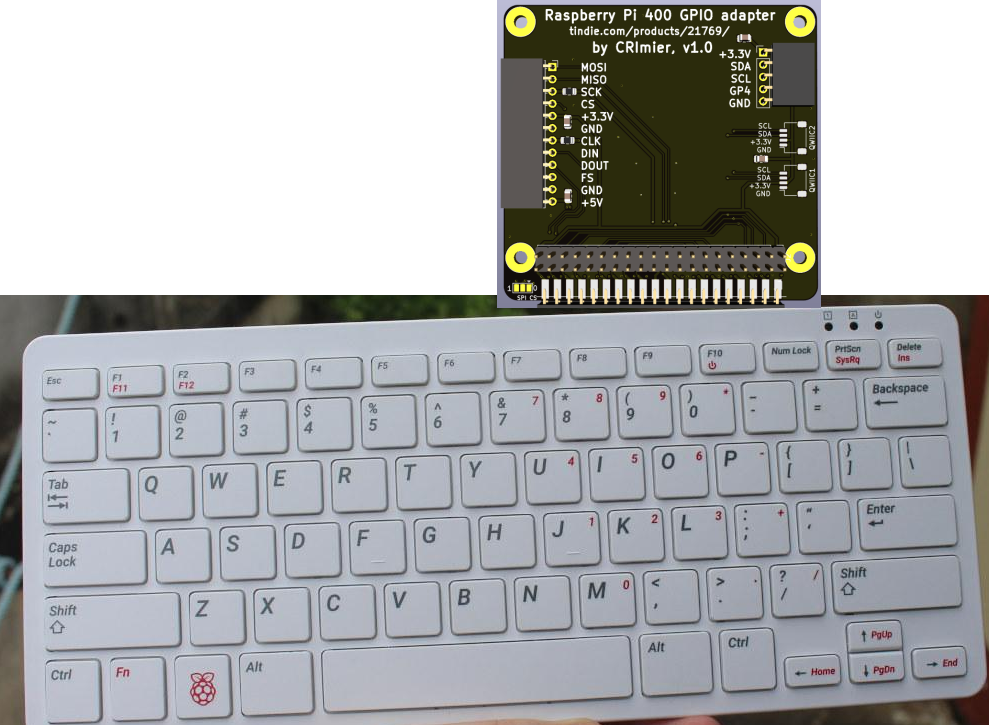
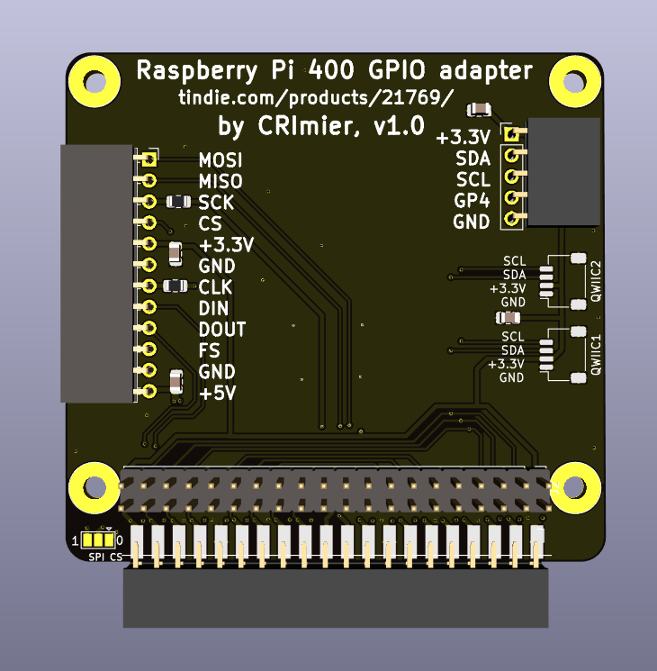
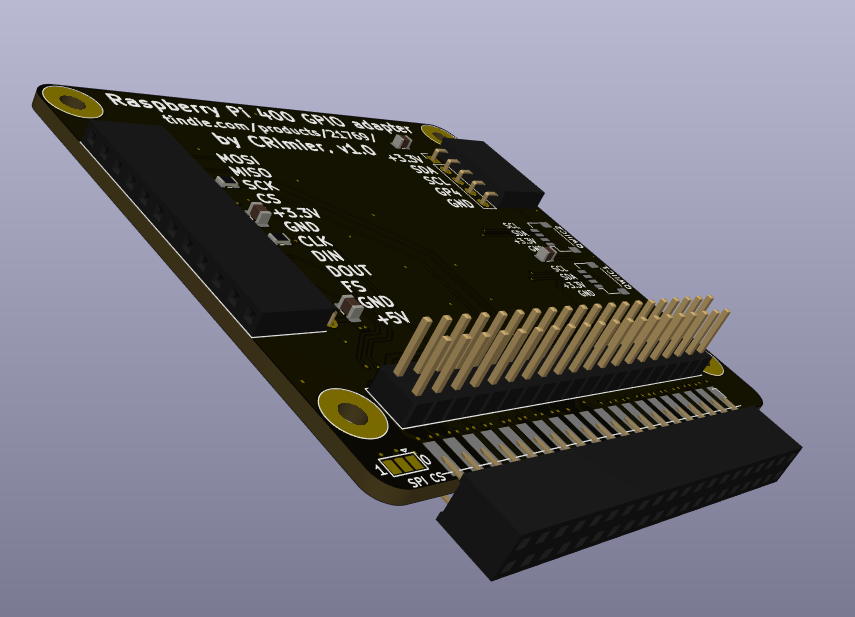

# Raspberry Pi 400 GPIO adapter board

This board is designed to be plugged into a Raspberry Pi 400 and allow to plug a HAT into your Pi 400 the same way that
you'd plug a hat onto your Raspberry Pi. Apart from that, it also has 2 QWIIC connectors, one 5-pin I2C pin header
with an extra GPIO (same pinout as Pi pins 1-9) and one custom-pinout pin header with SPI, I2S, 3.3V and 5V (same pinout
as the ZeroPhone expansion header pinout).

For ease of routing purposes, this is a 4-layer board, but it could probably be re-routed into a 2-layer board
if someone were willing to spend time on that. Sadly, the Pi 400 GPIO header pin assignment doesn't make for straightforward routing
when it comes to the connector placement I've devised, and I don't need this to be a 2-layer board at the moment.
Let me know if you want to make it into one - I can help you understand how to route it.

For custom connectors with I2C, SPI and I2S, signal names are silkscreened on the board's top layer, including the QWIIC pinout.

v1.0:
    - Initial commit
v2
    - stencil remains the same as in v1.0
    - enlarged mounting holes to 3.2mm
    - small routing mistakes fixed
    - changed I2C header footprint and moved it closer to the board edge

- PCB size: 55*60mm
- Layer count: 4
